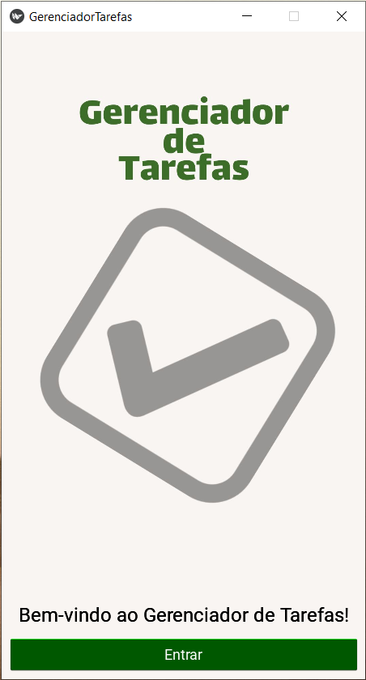
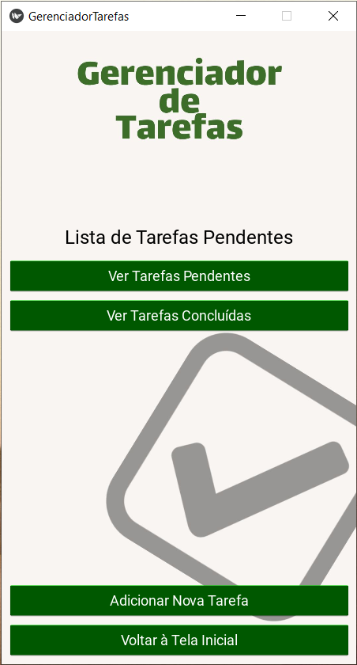
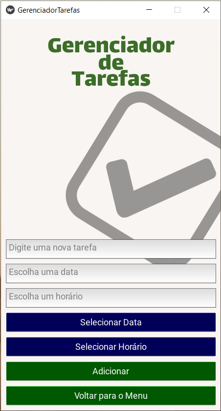
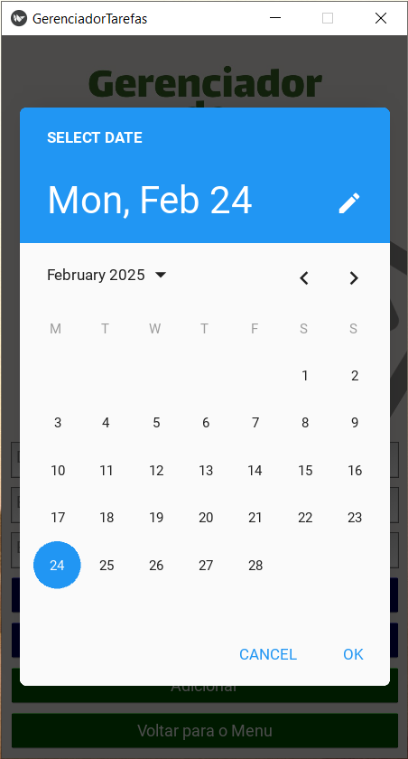
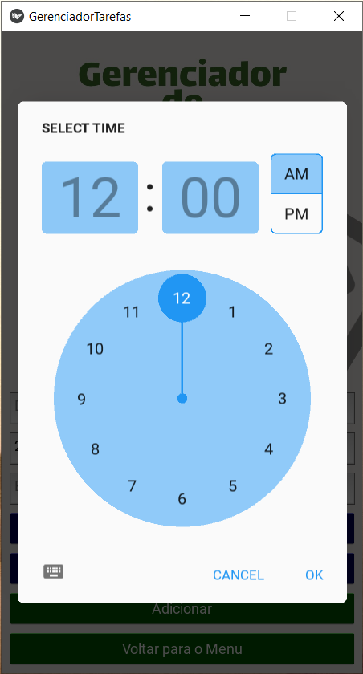
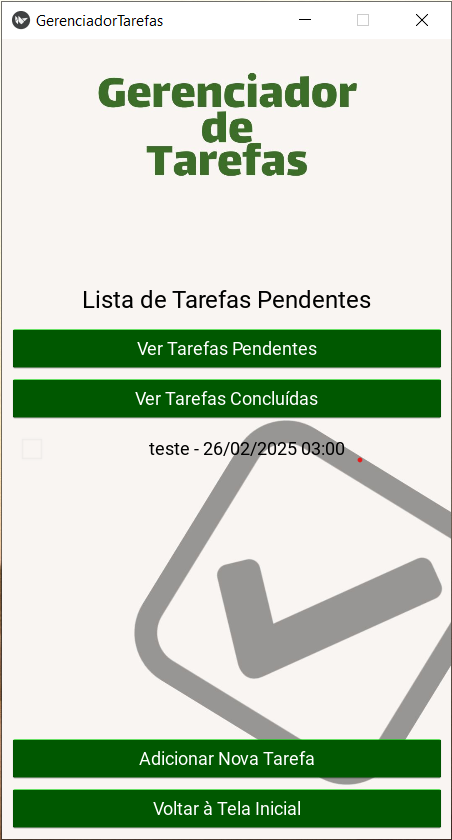
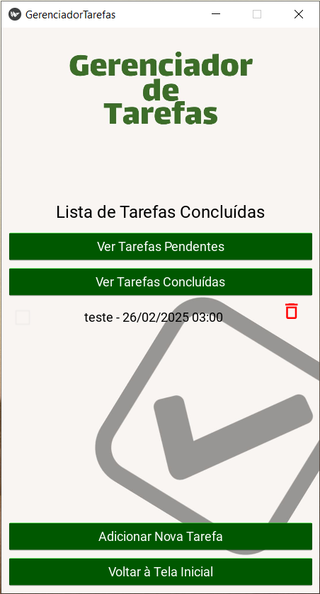

# ✅ To-Do List com Kivy e KivyMD

Este projeto é um gerenciador de tarefas desenvolvido com [Kivy](https://kivy.org/) e [KivyMD](https://kivymd.readthedocs.io/), com foco em uma interface amigável e responsiva. O principal diferencial é o sistema de **notificações automáticas**, que alerta o usuário sobre tarefas pendentes ou atrasadas, mesmo quando o aplicativo não está em uso.

## ✨ Funcionalidades

- 📋 Adição, edição e exclusão de tarefas.
- 🕒 Atribuição de datas e horários às tarefas.
- 🔔 **Notificações automáticas** para tarefas próximas ou vencidas.
- 💾 Armazenamento local das tarefas em formato JSON.
- 🎨 Interface moderna utilizando componentes do KivyMD.

## 🧠 Destaque: Sistema de Notificações

O sistema de notificações é implementado no módulo `notificacoes.py`. Ele utiliza a biblioteca [Plyer](https://plyer.readthedocs.io/en/latest/) para enviar notificações nativas ao sistema operacional. O funcionamento é o seguinte:

1. **Verificação periódica:** O aplicativo verifica periodicamente as tarefas armazenadas para identificar aquelas com prazos próximos ou vencidos.
2. **Envio de notificações:** Para cada tarefa identificada, é enviada uma notificação ao usuário com detalhes da tarefa.
3. **Integração com a interface:** As notificações são integradas de forma que, ao clicar nelas, o usuário é direcionado à tarefa correspondente no aplicativo.

Este sistema garante que o usuário seja constantemente lembrado de suas tarefas, melhorando a produtividade e a gestão do tempo.

## 📁 Estrutura do Projeto

<pre lang="markdown"> 
To-Do-List-Kivy/
├── classes/
│   └── (componentes personalizados e layouts)
├── main.py
├── manipulador_json.py
├── notificacoes.py
└── README.md
</pre>

- `main.py`: Arquivo principal que inicia o aplicativo.
- `manipulador_json.py`: Responsável por ler e escrever as tarefas no arquivo JSON.
- `notificacoes.py`: Gerencia o sistema de notificações.
- `classes/`: Contém componentes personalizados utilizados na interface.

## 🚀 Como Executar

1. **Clone o repositório:**

   ```bash
   git clone https://github.com/ArthurBritoo/To-Do-List-Kivy.git
   cd To-Do-List-Kivy
   ```

2. **(Opcional) Crie um ambiente virtual:**

   ```bash
   python -m venv venv
   source venv/bin/activate  # No Windows: venv\Scripts\activate
   ```

3. **Instale as dependências:**

   ```bash
   pip install kivy kivymd plyer
   ```

4. **Execute o aplicativo:**

   ```bash
   python main.py
   ```

## 🛠️ Requisitos

- Python 3.7 ou superior
- Bibliotecas:
  - Kivy
  - KivyMD
  - Plyer

## 📌 Observações

O sistema de notificações pode variar de acordo com o sistema operacional. Certifique-se de que as permissões necessárias estão concedidas para o envio de notificações.

Este projeto é uma base para futuras melhorias, como integração com bancos de dados, sincronização em nuvem e autenticação de usuários.

---

## 📸 Capturas de Tela

Abaixo, algumas imagens demonstrando o funcionamento do aplicativo:

### 🧾 Tela Principal – Lista de Tarefas  
Exibe todas as tarefas ativas e concluídas com ordenação por vencimento.  


---

### ➕ Adição de Nova Tarefa  
Permite ao usuário inserir título, descrição, data e horário de vencimento.  


---

### 🛠️ Edição de Tarefa Existente  
Interface para editar uma tarefa previamente adicionada.  


---

### 🔔 Notificação de Tarefa Pendente  
Notificação automática gerada para lembrar o usuário de tarefas próximas ou atrasadas.  


---

### ✅ Tarefa Marcada como Concluída  
Exemplo de uma tarefa que já foi finalizada.  


---

### 📅 Organização Cronológica  
As tarefas são ordenadas de forma automática pela proximidade do vencimento.  


---

### 🌙 Interface com Suporte a Temas  
Visual moderno com suporte para modo escuro.  


---

> 💡 **Dica:** Armazene suas capturas de tela na pasta `prints/` no repositório para manter tudo bem organizado.